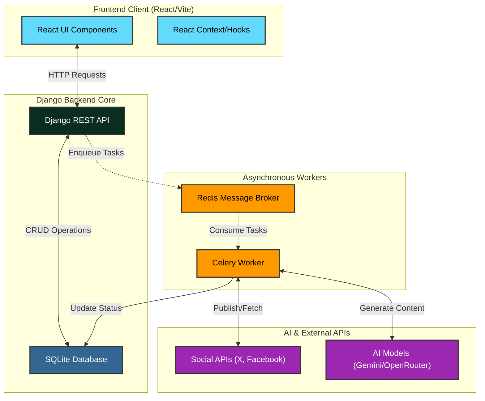
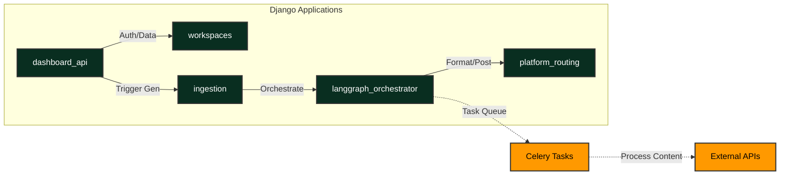
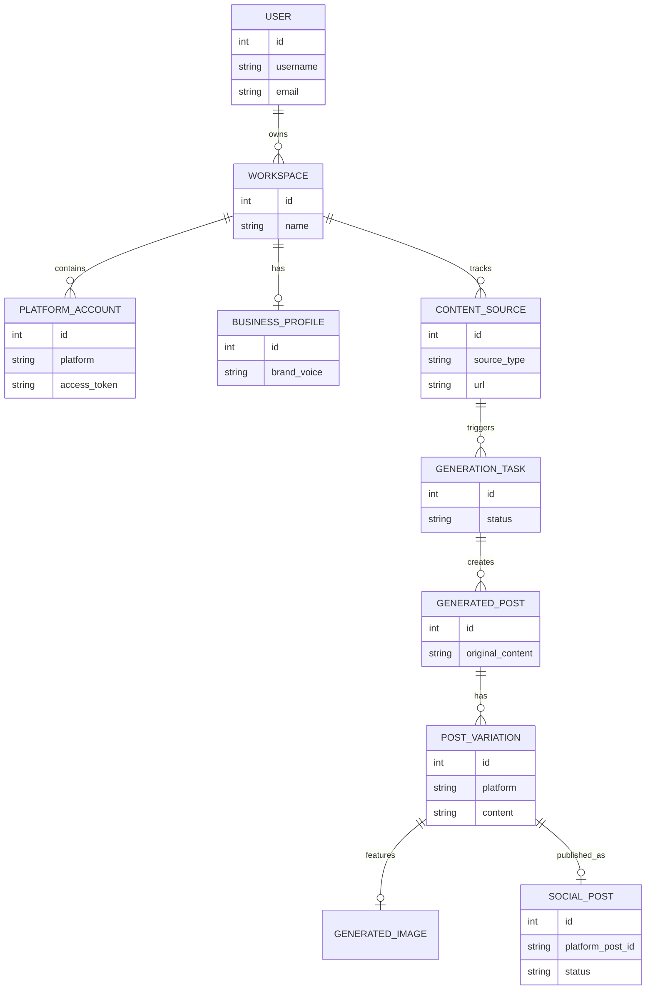

# CruiseContent 🚢

CruiseContent is the ultimate AI-powered social media automation suite. Built by creators, for creators, it provides a centralized dashboard to generate and schedule intelligent social media content natively utilizing specialized AI models.

## Architecture

This project is built using a modern, decoupled architecture:
- **Frontend**: React via Vite (`frontend/`) using `framer-motion` and Tailwind CSS.
- **Backend**: Django & Django REST Framework (`backend/`).
- **Asynchronous Task Queue**: Celery (using Redis as the message broker).
- **Database**: SQLite3 (Development).

---

## Internal Team Onboarding: Local Development Setup

To get this project running locally on your machine, you must strictly follow these steps in order. Ensure you have Docker, Python (3.11+), and Node.js installed.

### 1. Start the Redis Broker
Celery depends on Redis for the task queue. We use Docker to spin up a local instance:
```powershell
# Run from any terminal
docker run -p 6379:6379 redis
```

### 2. Setup the Backend (Django + Celery)
Open a new terminal window, navigate to the `backend/` folder, and setup the Python virtual environment:
```powershell
cd backend
python -m venv venv
.\venv\Scripts\activate
pip install -r requirements.txt
```

Once the environment is active and dependencies are installed, you need to start **two** processes in the backend.

**Terminal 2A (Django Server):**
```powershell
python manage.py migrate
python manage.py runserver
```

**Terminal 2B (Celery Worker):**
Open another terminal, navigate to `backend/`, activate the venv again, and start the Celery worker. *Note: We use `--pool=solo` on Windows to avoid process forking issues.*
```powershell
.\venv\Scripts\activate
python -m celery -A core worker -l info --pool=solo
```

### 3. Setup the Frontend (Vite)
Open a final terminal window, navigate to the `frontend/` directory, install Node modules, and start the development server:
```powershell
cd frontend
npm install
npm run dev
```
The frontend will be available at `http://localhost:5173`.

---

## File and Page-Based Routing (Frontend)

Our React application structure aims to emulate file-based routing for ease of use. 
- All individual pages/views are stored inside `frontend/src/pages/`. 
- However, we use `react-router-dom` in `frontend/src/App.jsx` to map these pages to URLs manually.

If you create a new page component (e.g. `src/pages/Analytics.jsx`), you **must** import it and register the `<Route path="/analytics" element={<Analytics />} />` inside `App.jsx` for it to become accessible.

The `<Navbar />` is a globally injected floating header in `App.jsx` that persists across all pages, adapting its buttons based on `useLocation()`.

---

## Security & Modularity Standards

- **Environment Variables**: Never hardcode API keys. Place them in `.env` inside `backend/` and use `os.environ.get()` in `settings.py`.
- **CORS**: `CORS_ALLOWED_ORIGINS` is restricted to `localhost:5173`. Update this when preparing for staging/production deployments.
- **Git Hygiene**: `backend/media/`, `backend/static/`, and `frontend/dist/` are strictly `.gitignore`'d. Do not push large user assets or build bundles to the repository.

---

## Contributing & Support

If you need help or wish to propose architectural changes to the repository, please reach out to **Akshit Sharma** at **akshitsharmacodes@gmail.com**. Pull Requests must be reviewed by Akshit before merging to the `main` branch.


## 🏗 System Architecture (HLD)



## 🧩 Low-Level Design (LLD)



## 🗄️ Entity Relationship Diagram (ERD)


