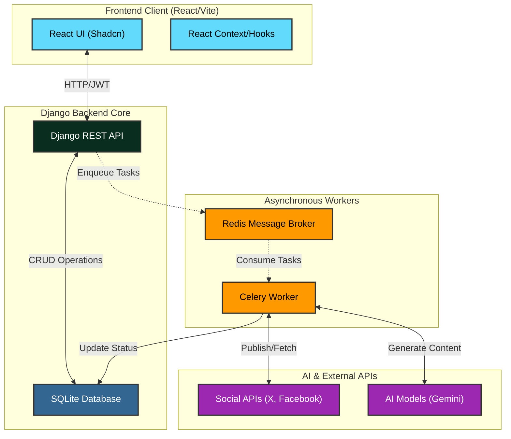
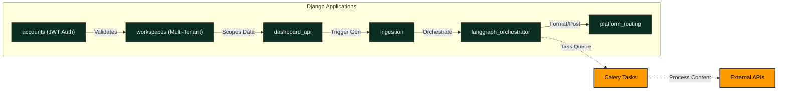
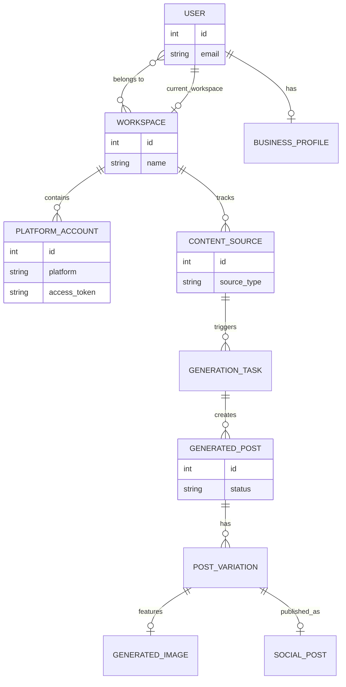

# CruiseContent 🚢

CruiseContent is the ultimate AI-powered social media automation suite. Built by creators, for creators, it provides a centralized dashboard to generate and schedule intelligent social media content natively utilizing specialized AI models.

## 🌟 What is CruiseContent?

CruiseContent bridges the gap between raw ideas and published social media posts. It acts as your personal AI content team—ingesting content from various sources, generating tailored variations for different platforms, and handling the publishing lifecycle automatically.

### Key Features
- **Multi-Workspace Architecture**: Manage multiple brands, clients, or projects under a single user account. Each workspace maintains its own isolated AI configurations, social media connections, and generation history.
- **Smart Content Ingestion**: Automatically ingest content via RSS feeds, Webhooks, or manual URL inputs to serve as the baseline for your AI generations.
- **Platform-Native Formatting**: The AI understands the nuances of different platforms. It generates short-form punchy text for Twitter/X, visually descriptive captions for Instagram, and professional long-form content for LinkedIn—all from a single prompt.
- **Integrated AI Workloads**: 
  - **Text Generation**: Powered by advanced LLMs (Gemini / OpenRouter) to write high-converting copy.
  - **Image Generation**: Automatically generate accompanying images based on the context of the generated text.
- **Asynchronous Task Queue**: Heavy AI generation tasks and external API calls are handled entirely in the background via Celery and Redis, ensuring the frontend remains lightning-fast.
- **Custom Authentication**: Highly secure JWT-based authentication system with HttpOnly refresh cookies and Google OAuth2 integration.
- **Admin & Analytics Dashboard**: Built-in tiered access control and an administrative overview to track user life-cycles, payments, and system health.

## 🏗 System Architecture (HLD)

The platform is designed with a decoupled architecture leveraging background task processing for heavy AI workloads.



**Detailed Explanation of High-Level Design (HLD):**
- **Frontend Client (React/Vite)**: The user interface is built using React 19 and Vite for fast bundling. It relies on Tailwind and Shadcn UI for a consistent, premium design system. State is managed via React Context and Hooks.
- **Django Backend Core**: Serves as the primary REST API. It handles incoming HTTP requests, performs business logic, authenticates users via custom JWTs (stored in HttpOnly cookies), and manages the database.
- **Asynchronous Workers**: To prevent the API from hanging on long-running AI tasks, heavy workloads are delegated to a Redis Message Broker. Celery workers consume these tasks asynchronously.
- **AI & External APIs**: The Celery workers communicate directly with AI models (Gemini/OpenRouter) for content generation and external Social APIs (Twitter/X, Facebook, etc.) for publishing.

## 🧩 Low-Level Design (LLD)

Our Django backend is split into multiple highly decoupled applications. Authentication is handled via Custom JWTs stored in memory and HttpOnly cookies, completely bypassing default Session CSRF vulnerabilities.



**Detailed Explanation of Low-Level Design (LLD):**
- **accounts (JWT Auth)**: Manages user authentication strictly through HttpOnly JWT cookies to prevent CSRF vulnerabilities.
- **workspaces (Multi-Tenant)**: Handles the isolation of data. A user can belong to multiple workspaces, and all content and keys are scoped to a specific workspace.
- **dashboard_api**: The primary interface for the frontend to fetch dashboard statistics, content sources, and trigger manual actions.
- **ingestion**: Responsible for pulling in raw content from RSS feeds, webhooks, or manual entry.
- **langgraph_orchestrator**: The AI brain. It orchestrates prompts, talks to AI models, and formats output based on platform-specific rules.
- **platform_routing**: Handles the final mile—taking AI-generated content and routing it to the correct external social media API using saved OAuth tokens.

## 🗄️ Entity Relationship Diagram (ERD)

Our database is built for a Multi-Workspace architecture where a single User profile can own and switch between multiple workspaces.



**Detailed Explanation of Entity Relationship Diagram (ERD):**
- **User & Workspace**: The core of the multi-tenant architecture. A `USER` can belong to many `WORKSPACE`s, but has one `current_workspace` active at a time. A user also has a `BUSINESS_PROFILE`.
- **Platform Account**: Stores the OAuth tokens and platform details (e.g., Twitter, Meta) scoped to a workspace.
- **Content Source**: Represents RSS feeds or webhooks tracked by a workspace. When new content arrives, it triggers a `GENERATION_TASK`.
- **Generation Task & Generated Post**: A task represents the async background job. It creates a `GENERATED_POST` which acts as a container for platform-specific variations.
- **Post Variation & Media**: Each variation (e.g., a short tweet vs. a long LinkedIn post) belongs to a `GENERATED_POST`. Variations can share a `GENERATED_IMAGE`.
- **Social Post**: The final record representing a successful or failed publish attempt to the external platform.

---

## 🛠️ Internal Team Onboarding: Local Development Setup

To get this project running locally on your machine, you must strictly follow these steps in order. Ensure you have Docker, Python (3.11+), and Node.js installed.

### 1. Start the Redis Broker
Celery depends on Redis for the task queue. We use Docker to spin up a local instance:
```powershell
# Run from any terminal
docker run -p 6379:6379 redis
```

### 2. Setup the Backend (Django + Celery)
Open a new terminal window, navigate to the `backend/` folder, and setup the Python virtual environment:
```powershell
cd backend
python -m venv venv
.\venv\Scripts\activate
pip install -r requirements.txt
```

Once the environment is active and dependencies are installed, you need to start **two** processes in the backend.

**Terminal 2A (Django Server):**
```powershell
python manage.py migrate
python manage.py runserver
```

**Terminal 2B (Celery Worker):**
Open another terminal, navigate to `backend/`, activate the venv again, and start the Celery worker. *Note: We use `--pool=solo` on Windows to avoid process forking issues.*
```powershell
.\venv\Scripts\activate
python -m celery -A core worker -l info --pool=solo
```

### 3. Setup the Frontend (Vite)
Open a final terminal window, navigate to the `frontend/` directory, install Node modules, and start the development server:
```powershell
cd frontend
npm install
npm run dev
```
The frontend will be available at `http://localhost:5173`.

---

## 🔒 Security & Git Hygiene Standards

- **Environment Variables**: Never hardcode API keys. Place them in `.env` inside `backend/`. 
- **CORS & Auth**: The API relies entirely on custom JWTs (`accounts/authentication.py`). We have explicitly stripped `SessionAuthentication` from DRF to prevent CSRF bugs when passing `credentials: include`.
- **Git Ignore**: `db.sqlite3`, `backend/media/`, `backend/static/`, `frontend/node_modules/`, and `frontend/dist/` are strictly `.gitignore`'d. Do not push databases or large user assets to the repository.

---

## Contributing & Support
If you need help or wish to propose architectural changes to the repository, please reach out to **Akshit Sharma** at **akshitsharmacodes@gmail.com**. Pull Requests must be reviewed by Akshit before merging to the `main` branch.
